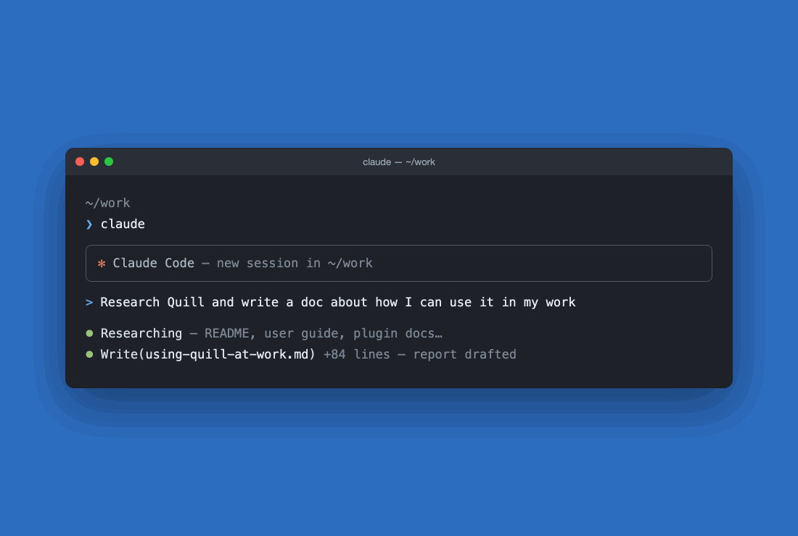

# Quill

A **collaborative writing environment for you and Claude** — take the plans, reports, and docs your agent drafts out of the CLI and work on them together in a real editor, with Google-Docs-style **tracked changes**, **inline comments**, and **@claude replies from the session that wrote the document**.



Files are plain `.md` on disk; review metadata rides alongside in a sidecar, so the Markdown stays portable and editable anywhere.

> **The defining feature:** a document can be linked to the Claude Code session that authored it. A reviewer can reply to a comment with `@claude` and get an inline, context-aware answer from the same agent — even after that session has been compacted.

## Features

- **WYSIWYG Markdown editing** built on Tiptap/ProseMirror, with a formatting toolbar (bold, italic, underline, strikethrough, headings, lists, blockquote, inline code) and undo/redo.
- **Suggesting mode** — a Google-Docs-style toggle that tracks edits as insertions and deletions instead of applying them directly. Each pending change gets a margin card with per-change **Accept** / **Reject**, plus **Accept All** / **Reject All**.
- **Inline comments** — anchor a threaded comment to a text range; reply, resolve, and delete. Comment cards live in the right margin with collision-avoidance so they never overlap.
- **`@claude` replies** — link a document to its authoring Claude Code session and ask questions in a comment thread. Answers stream back inline. Quill sends a line diff of what changed (or the full document, if the session's context was compacted).
- **AI-authored tracked changes** — ask Claude in a comment to _revise_ the text ("tighten this", "fix the grammar") and it writes the edits straight into the document as **tracked changes attributed to Claude** — reviewed as ordinary Accept / Reject suggestion cards, just like a human's. Scope follows your phrasing: the highlighted text by default, or "this paragraph" / "the whole document".
- **Reference folder** — link a document to a folder of source material (notes, research, data files). Every `@claude` request grants Claude read access to that folder and includes a manifest of its contents, so it can pull in the relevant sources before answering.
- **Deep links** — `quill://open?file=…` opens a document directly, e.g. launched from a Claude Code session, restoring its comments, suggestions, and session binding.
- **Quality-of-life** — document zoom (60–240%), four persisted color themes, a live status bar (word/char count, line/column, dirty indicator), and standard file shortcuts (New, Open, Save, Save As).

## Persistence model

Every saved document is two files:

| File                   | Contents                                                                                    |
| ---------------------- | ------------------------------------------------------------------------------------------- |
| `<name>.md`            | Portable Markdown — the document itself.                                                    |
| `<name>.comments.json` | Sidecar holding comments, suggestions, the linked Claude session, and the reference folder. |

The sidecar is deleted automatically on save when it holds nothing, so a document with no review metadata is just a clean `.md` file.

## Install

Grab the installer for your Mac from the [latest GitHub Release](https://github.com/sam-powers/quill/releases/latest):

| Platform              | File            |
| --------------------- | --------------- |
| macOS (Apple Silicon) | `…_aarch64.dmg` |
| macOS (Intel)         | `…_x64.dmg`     |

Releases are **macOS-only** for now — the `@claude` integration locates the Claude CLI and its sessions via Unix paths, and we'd rather not ship builds that can't deliver the full experience. Windows and Linux users can still [build from source](#building-from-source) (on Linux everything works, including `@claude`; on Windows the editor works but `@claude` is not yet supported).

**macOS:** the app is not yet code-signed, so the first launch is blocked by Gatekeeper. Right-click (or Control-click) **Quill.app** and choose **Open**, then **Open** again in the dialog — only needed once. (Alternatively: `xattr -dr com.apple.quarantine /Applications/Quill.app`.)

New to Quill? Start with the **[User Guide](./docs/USER_GUIDE.md)** — no programming knowledge required.

### Setting up `@claude`

Editing, tracked changes, and comments work standalone. The `@claude` features — AI replies and AI-authored tracked changes — need the [Claude Code](https://claude.com/claude-code) CLI on the same machine:

1. **Install Claude Code** (skip if `claude --version` already works):

   ```bash
   curl -fsSL https://claude.ai/install.sh | bash
   ```

2. **Sign in** — run `claude` in a terminal and follow the login prompt. Quill talks to the CLI under your account; there are no API keys to configure.

3. **Launch Quill once** so macOS registers the `quill://` deep-link scheme.

4. **Install the Quill plugin for Claude Code** — this adds the slash command that sends a document from a Claude Code session straight into Quill:

   ```bash
   claude plugin marketplace add sam-powers/quill
   claude plugin install quill-integration@quill-official
   ```

The loop this enables: draft a document with Claude Code, run `/quill-integration:open-in-quill draft.md` in the session, and the document opens in Quill already linked to that session — comment `@claude …` anywhere and the agent that wrote the document answers, or revises it as tracked changes for you to accept or reject. See the [plugin README](./plugin/quill-integration/README.md) for details.

## Building from source

**Prerequisites:** [Node.js](https://nodejs.org) 22+, a [Rust toolchain](https://rustup.rs), and the [Tauri 2 system dependencies](https://v2.tauri.app/start/prerequisites/) for your platform. The `@claude` feature additionally requires the [Claude Code](https://claude.com/claude-code) CLI on your `PATH`.

```bash
# Install JS dependencies
npm install

# Run the full desktop app with hot reload
npm run tauri dev

# Produce a distributable bundle for your platform
npm run tauri build
```

`npm run dev` runs only the Vite frontend in a browser (no native window, no file I/O) — useful for UI work.

## Development

```bash
npm run typecheck     # tsc --noEmit
npm run lint          # eslint
npm run format:check  # prettier --check
npm test              # vitest (unit + component)
npx playwright test   # end-to-end (requires browsers: npx playwright install)

cd src-tauri && cargo test && cargo clippy -- -D warnings && cargo fmt --check
```

CI runs the full frontend and Rust suites on every push and pull request to `main`. Pushing a version tag (`v*`) triggers the [release workflow](./.github/workflows/release.yml), which builds macOS installers (Apple Silicon + Intel) and attaches them to a **draft** GitHub Release for a maintainer to review and publish.

### Project layout

```
src/                  React/TypeScript frontend
  App.tsx             Top-level orchestration (editor, comments, suggestions, shortcuts)
  components/         Editor, toolbar, comment/suggestion cards, footer, session picker
  extensions/         Tiptap extensions: TrackChanges, Comment
  hooks/              File I/O, comment/suggestion state, Claude replies
  types/              Shared data contract (Comment, Suggestion, SidecarFile, …)
  utils/              Pure helpers (sidecar paths, tracked-edit diffing)
  test/               Vitest unit/component tests
src-tauri/            Rust/Tauri backend (file I/O, dialogs, Claude session integration)
e2e/                  Playwright end-to-end specs
plugin/               Claude Code plugin that opens files in Quill via deep link
.claude-plugin/       Marketplace manifest so `claude plugin marketplace add` finds the plugin
docs/                 Design references and supporting docs
```

See [`PRD.md`](./PRD.md) for the full as-built product spec and [`CLAUDE.md`](./CLAUDE.md) for architecture notes.

## License

Released under the [Apache License 2.0](./LICENSE).
